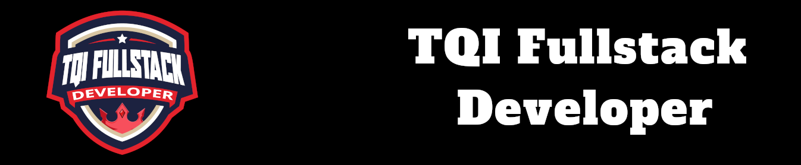

# Desafio: Desafios HTML/CCS Boot Camp TQI

Nesse projeto você aprenderá os mais importantes tópicos para alavancar no mundo das animações utilizando CSS. Dentre eles o CSS Transitions utilizando pseudo elementos e pseudo classes e também CSS @keyframes. Ao fim do projeto, teremos a construção de um portfólio apenas utilizando HTML e CSS para fixação das aulas.

## Tecnologias

* HTML5
* CSS3

## Instrutor(a)

Gabriela Pinheiro

Frontend Engineer, Cornershop by Uber

## Entidade

Digital Inovation one 

## Autor
Edson souza

[Linkedin](https://www.linkedin.com/in/edsonfrs/)

[GitHub](https://github.com/Edsonfrs)

